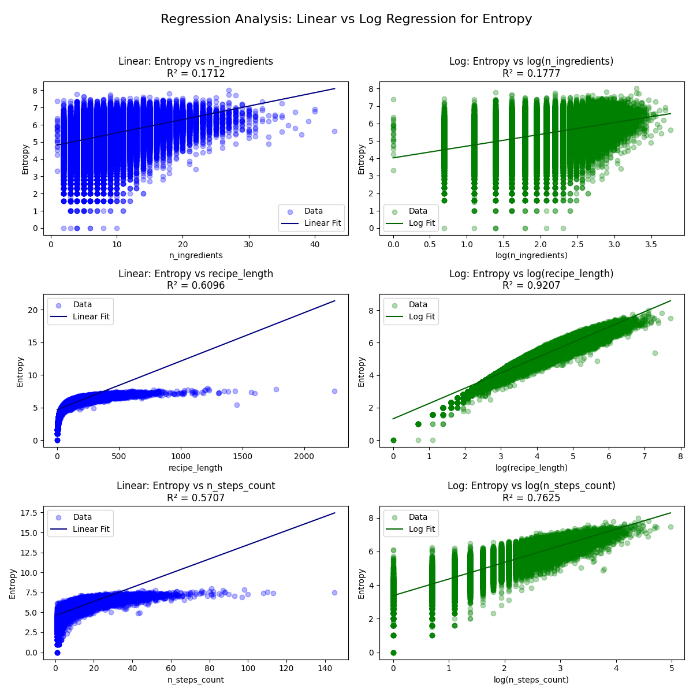
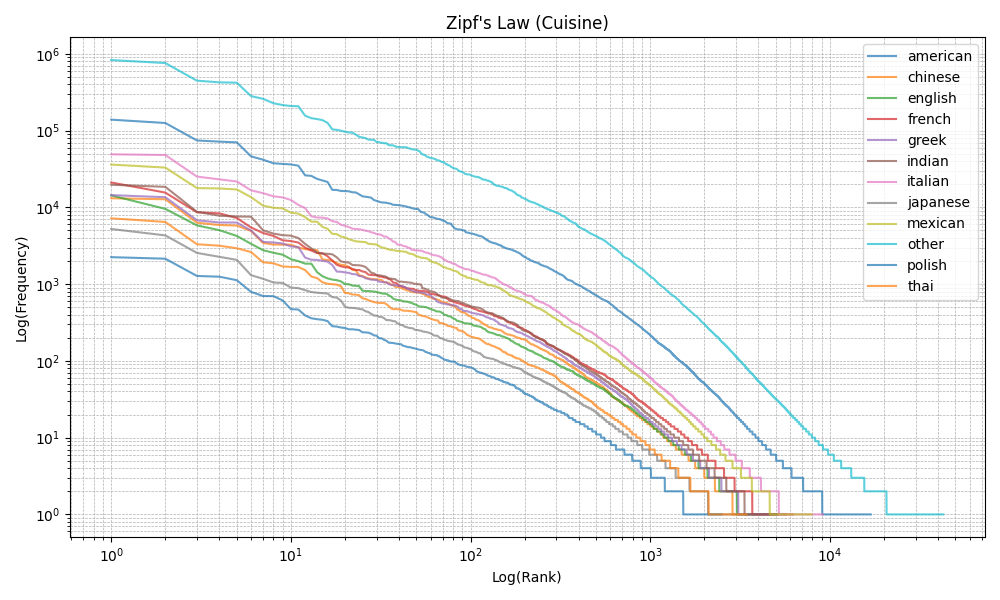
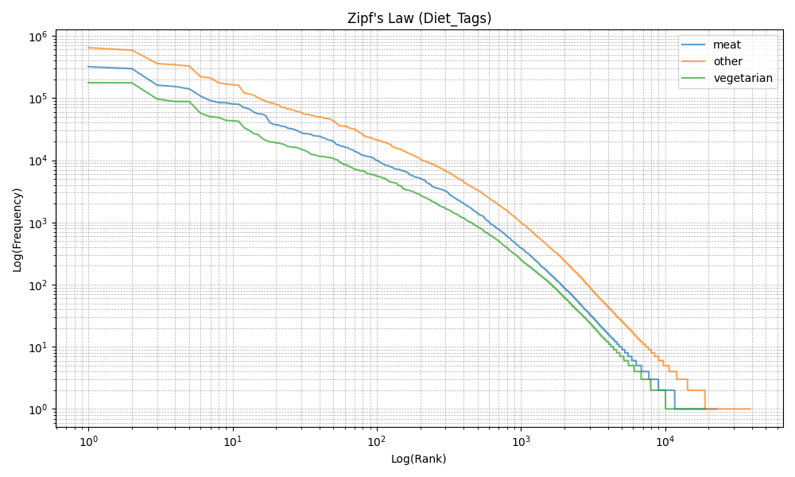
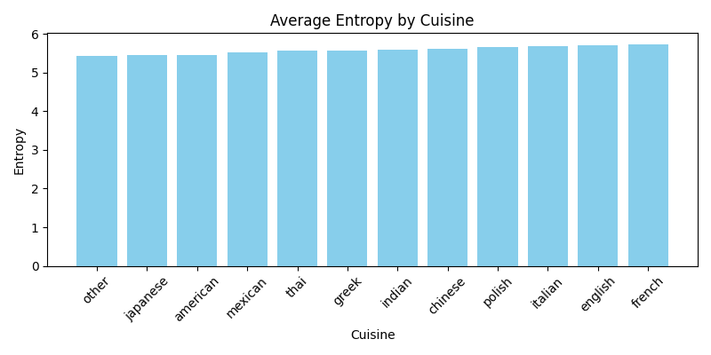
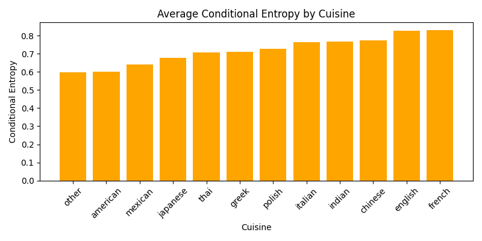
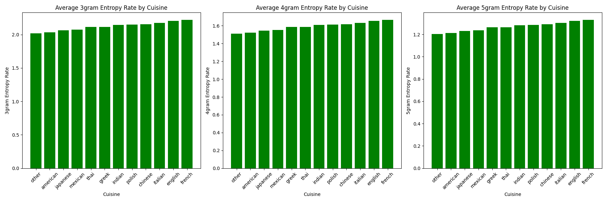
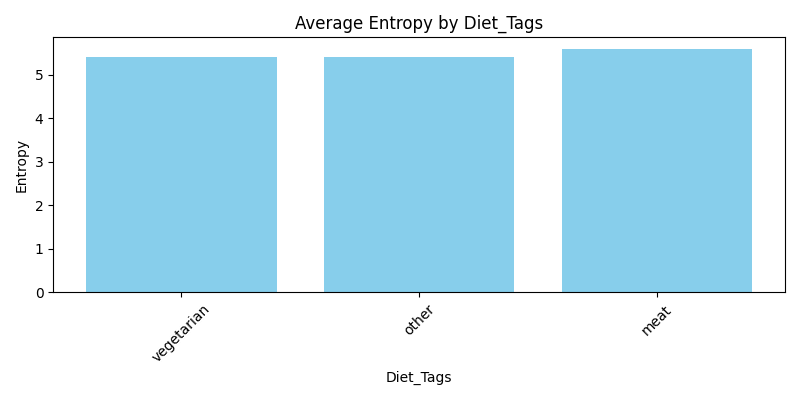
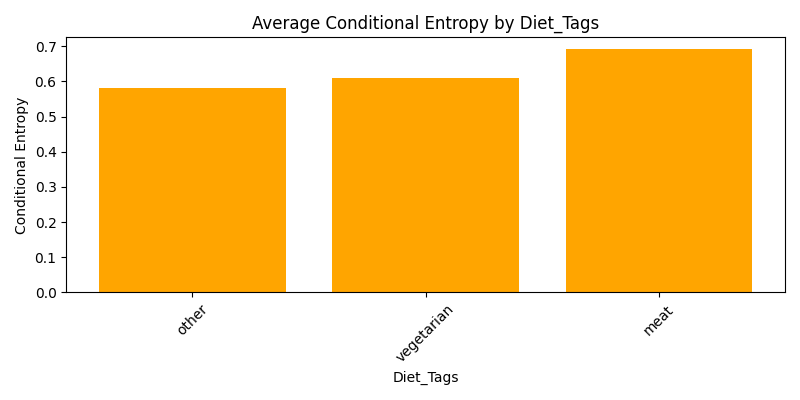
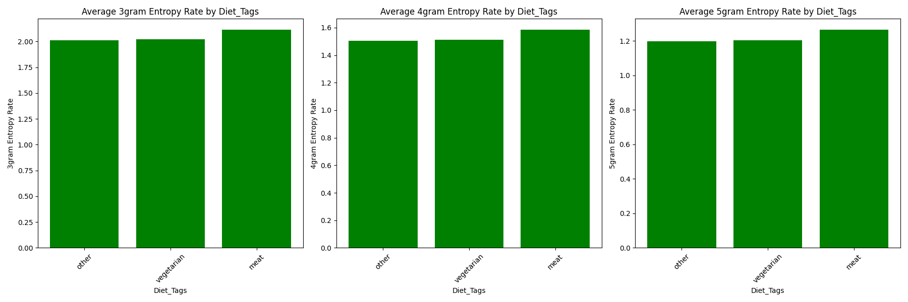

# Import


```python
import re
from collections import Counter

import numpy as np
import pandas as pd
import matplotlib.pyplot as plt
from scipy.optimize import curve_fit
from pyitlib import discrete_random_variable as drv
from sklearn.linear_model import LinearRegression

%matplotlib inline

print("Libraries imported successfully.")

```

    Libraries imported successfully.
    

# Prepare the dataset


```python
recipes = pd.read_csv("RAW_recipes.csv")
print("Head of the dataset:")
print(recipes.head(), "\n")

# Filtering only the columns I am interested in
recipes_filtered = recipes[['name', 'tags', 'minutes', 'n_ingredients', 'steps', 'ingredients']].copy()

# Droping rows with missing values in steps or ingredients
recipes_filtered.dropna(subset=['steps', 'ingredients'], inplace=True)

# Converting steps from string to list, keeping only non-empty lists
def not_empty_steps(steps_str):
    try:
        steps_list = eval(steps_str)
        return len(steps_list) > 0
    except:
        return False

recipes_filtered = recipes_filtered[recipes_filtered['steps'].apply(not_empty_steps)]

```

    Head of the dataset:
                                             name      id  minutes  \
    0  arriba   baked winter squash mexican style  137739       55   
    1            a bit different  breakfast pizza   31490       30   
    2                   all in the kitchen  chili  112140      130   
    3                          alouette  potatoes   59389       45   
    4          amish  tomato ketchup  for canning   44061      190   
    
       contributor_id   submitted  \
    0           47892  2005-09-16   
    1           26278  2002-06-17   
    2          196586  2005-02-25   
    3           68585  2003-04-14   
    4           41706  2002-10-25   
    
                                                    tags  \
    0  ['60-minutes-or-less', 'time-to-make', 'course...   
    1  ['30-minutes-or-less', 'time-to-make', 'course...   
    2  ['time-to-make', 'course', 'preparation', 'mai...   
    3  ['60-minutes-or-less', 'time-to-make', 'course...   
    4  ['weeknight', 'time-to-make', 'course', 'main-...   
    
                                        nutrition  n_steps  \
    0       [51.5, 0.0, 13.0, 0.0, 2.0, 0.0, 4.0]       11   
    1   [173.4, 18.0, 0.0, 17.0, 22.0, 35.0, 1.0]        9   
    2  [269.8, 22.0, 32.0, 48.0, 39.0, 27.0, 5.0]        6   
    3   [368.1, 17.0, 10.0, 2.0, 14.0, 8.0, 20.0]       11   
    4   [352.9, 1.0, 337.0, 23.0, 3.0, 0.0, 28.0]        5   
    
                                                   steps  \
    0  ['make a choice and proceed with recipe', 'dep...   
    1  ['preheat oven to 425 degrees f', 'press dough...   
    2  ['brown ground beef in large pot', 'add choppe...   
    3  ['place potatoes in a large pot of lightly sal...   
    4  ['mix all ingredients& boil for 2 1 / 2 hours ...   
    
                                             description  \
    0  autumn is my favorite time of year to cook! th...   
    1  this recipe calls for the crust to be prebaked...   
    2  this modified version of 'mom's' chili was a h...   
    3  this is a super easy, great tasting, make ahea...   
    4  my dh's amish mother raised him on this recipe...   
    
                                             ingredients  n_ingredients  
    0  ['winter squash', 'mexican seasoning', 'mixed ...              7  
    1  ['prepared pizza crust', 'sausage patty', 'egg...              6  
    2  ['ground beef', 'yellow onions', 'diced tomato...             13  
    3  ['spreadable cheese with garlic and herbs', 'n...             11  
    4  ['tomato juice', 'apple cider vinegar', 'sugar...              8   
    
    


```python
print("Dataset info:")
print(recipes.info())
```

    Dataset info:
    <class 'pandas.core.frame.DataFrame'>
    RangeIndex: 231637 entries, 0 to 231636
    Data columns (total 12 columns):
     #   Column          Non-Null Count   Dtype 
    ---  ------          --------------   ----- 
     0   name            231636 non-null  object
     1   id              231637 non-null  int64 
     2   minutes         231637 non-null  int64 
     3   contributor_id  231637 non-null  int64 
     4   submitted       231637 non-null  object
     5   tags            231637 non-null  object
     6   nutrition       231637 non-null  object
     7   n_steps         231637 non-null  int64 
     8   steps           231637 non-null  object
     9   description     226658 non-null  object
     10  ingredients     231637 non-null  object
     11  n_ingredients   231637 non-null  int64 
    dtypes: int64(5), object(7)
    memory usage: 21.2+ MB
    None
    

# Tokenization


```python
# Tokenize the steps
def preprocess_and_tokenize(steps_str):
    steps_list = eval(steps_str)  # Convert string to list
    text = " ".join(steps_list).lower()
    text = re.sub(r'[^\w\s]', '', text)  # Remove punctuation
    text = re.sub(r'\d+', '', text)      # Remove digits
    words = text.split()
    return words

recipes_filtered['tokenized_steps'] = recipes_filtered['steps'].apply(preprocess_and_tokenize)
print("Tokenization complete. Sample tokenized steps:")
print(recipes_filtered['tokenized_steps'].head())

```

    Tokenization complete. Sample tokenized steps:
    0    [make, a, choice, and, proceed, with, recipe, ...
    1    [preheat, oven, to, degrees, f, press, dough, ...
    2    [brown, ground, beef, in, large, pot, add, cho...
    3    [place, potatoes, in, a, large, pot, of, light...
    4    [mix, all, ingredients, boil, for, hours, or, ...
    Name: tokenized_steps, dtype: object
    

# Grouping the recipes


```python
cuisines = [
    'italian', 'mexican', 'indian', 'chinese', 'french',
    'japanese', 'american', 'greek', 'thai', 'polish', 'english'
]

def extract_cuisine(tags_str):
    try:
        tags_list = eval(tags_str)
    except:
        return 'other'
    for c in cuisines:
        if c in tags_list:
            return c
    return 'other'

recipes_filtered['cuisine'] = recipes_filtered['tags'].apply(extract_cuisine)

def find_diet_tags(tags_str):
    try:
        tags_list = eval(tags_str)
    except:
        return 'other'
    if 'meat' in tags_list:
        return 'meat'
    elif 'vegetarian' in tags_list:
        return 'vegetarian'
    elif 'vegan' in tags_list:
        return 'vegan'
    return 'other'

recipes_filtered['diet_tags'] = recipes_filtered['tags'].apply(find_diet_tags)

# Defining the groups for my analyses (after the feedback natural categories only)
groups = ['cuisine', 'diet_tags']

for group in groups:
    print(f"Unique elements in {group}:")
    print(recipes_filtered[group].value_counts(), "\n")
```

    Unique elements in cuisine:
    other       175708
    american     29010
    italian       7410
    mexican       6677
    indian        2706
    greek         2213
    french        2201
    chinese       1995
    english       1416
    thai          1156
    japanese       795
    polish         349
    Name: cuisine, dtype: int64 
    
    Unique elements in diet_tags:
    other         139960
    meat           56042
    vegetarian     35634
    Name: diet_tags, dtype: int64 
    
    

# Basic entropy measures


```python
# Shannon Entropy (unigrams)
def calculate_entropy(words):
    word_counts = Counter(words)
    total_words = len(words)
    if total_words == 0:
        return 0.0
    probabilities = [count / total_words for count in word_counts.values()]
    entropy = -sum(p * np.log2(p) for p in probabilities)
    return entropy

recipes_filtered['entropy'] = recipes_filtered['tokenized_steps'].apply(calculate_entropy)
print("Basic entropy stats on the whole dataset:")
print(recipes_filtered['entropy'].describe())

# Conditional Entropy (bigrams)
def calculate_conditional_entropy(words):
    bigrams = [(words[i], words[i+1]) for i in range(len(words) - 1)]
    if len(bigrams) == 0:
        return 0.0
    bigram_counts = Counter(bigrams)
    unigram_counts = Counter(words)
    conditional_entropy_value = 0.0
    total_bigrams = sum(bigram_counts.values())
    for (w1, w2), count in bigram_counts.items():
        p_w1w2 = count / total_bigrams
        p_w1 = unigram_counts[w1] / len(words)
        if p_w1 > 0:
            p_cond = p_w1w2 / p_w1
            if p_cond > 0:
                conditional_entropy_value += p_w1w2 * np.log2(p_cond)
    conditional_entropy_value = -conditional_entropy_value
    return conditional_entropy_value

recipes_filtered['conditional_entropy'] = recipes_filtered['tokenized_steps'].apply(calculate_conditional_entropy)
print("\n\nBasic conditional entropy stats on the whole dataset:")
print(recipes_filtered['conditional_entropy'].describe())

```

    Basic entropy stats on the whole dataset:
    count    231636.000000
    mean          5.451791
    std           0.704029
    min          -0.000000
    25%           5.092987
    50%           5.539623
    75%           5.918865
    max           7.999994
    Name: entropy, dtype: float64
    
    
    Basic conditional entropy stats on the whole dataset:
    count    231636.000000
    mean          0.612983
    std           0.346685
    min          -1.000000
    25%           0.379619
    50%           0.603108
    75%           0.839824
    max           2.567500
    Name: conditional_entropy, dtype: float64
    

# N-gram entropy analysis


```python
def calculate_ngram_entropy(words, n):
    if len(words) < n:
        return 0.0
    ngrams = [tuple(words[i:i+n]) for i in range(len(words) - n + 1)]
    ngram_counts = Counter(ngrams)
    total_ngrams = len(ngrams)
    entropy = 0.0
    for count in ngram_counts.values():
        p = count / total_ngrams
        entropy -= p * np.log2(p)
    return entropy

def run_analyses_solo(df, col_name):
    # Shannon Entropy
    avg_entropy = df.groupby(col_name)['entropy'].mean().sort_values()
    print(f"\nAverage Entropy by {col_name.title()}")
    print(avg_entropy)
    plt.figure(figsize=(8, 4))
    plt.bar(avg_entropy.index, avg_entropy.values, color='skyblue')
    plt.title(f'Average Entropy by {col_name.title()}')
    plt.xlabel(col_name.title())
    plt.ylabel('Entropy')
    plt.xticks(rotation=45)
    plt.tight_layout()
    plt.savefig(f"./plots/shannon_entropy_by_{col_name}.png")
    plt.show()
    
    # Conditional Entropy
    avg_cond_entropy = df.groupby(col_name)['conditional_entropy'].mean().sort_values()
    print(f"\nAverage Conditional Entropy by {col_name.title()}")
    print(avg_cond_entropy)
    plt.figure(figsize=(8, 4))
    plt.bar(avg_cond_entropy.index, avg_cond_entropy.values, color='orange')
    plt.title(f'Average Conditional Entropy by {col_name.title()}')
    plt.xlabel(col_name.title())
    plt.ylabel('Conditional Entropy')
    plt.xticks(rotation=45)
    plt.tight_layout()
    plt.savefig(f"./plots/conditional_entropy_by_{col_name}.png")
    plt.show()
    
    # N-gram Entropy Rates
    fig, axs = plt.subplots(nrows=1, ncols=3, figsize=(18, 6))
    for i, n in enumerate([3, 4, 5]):
        col = f"{n}gram_entropy_rate"
        df[col] = df['tokenized_steps'].apply(lambda words: calculate_ngram_entropy(words, n=n) / n)
        avg_ngram = df.groupby(col_name)[col].mean().sort_values()
        axs[i].bar(avg_ngram.index, avg_ngram.values, color='green')
        axs[i].set_title(f'Average {n}gram Entropy Rate by {col_name.title()}')
        axs[i].set_xlabel(col_name.title())
        axs[i].set_ylabel(f'{n}gram Entropy Rate')
        axs[i].tick_params(axis='x', rotation=45)
    plt.tight_layout()
    plt.savefig(f"./plots/ngram_entropy_rates_by_{col_name}.png")
    plt.show()

```

# Mutual information among categories


```python
def mutual_info(df, col1, col2):
    temp_df = df[[col1, col2]].dropna().copy()
    temp_df[col1] = temp_df[col1].astype(str)
    temp_df[col2] = temp_df[col2].astype(str)
    temp_df[col1] = temp_df[col1].astype('category')
    temp_df[col2] = temp_df[col2].astype('category')
    x_cat = temp_df[col1].cat.codes.astype(int).values
    y_cat = temp_df[col2].cat.codes.astype(int).values
    neg_mask = (x_cat < 0) | (y_cat < 0)
    if neg_mask.any():
        print(f"[DEBUG] Dropping {neg_mask.sum()} rows with negative codes in {col1} or {col2}.")
        x_cat = x_cat[~neg_mask]
        y_cat = y_cat[~neg_mask]
    if len(x_cat) == 0:
        print(f"[WARNING] No valid rows remain for {col1} vs {col2} — returning 0.")
        return 0.0
    return drv.information_mutual(
        X=x_cat, Y=y_cat,
        cartesian_product=False,
        Alphabet_X=None,
        Alphabet_Y=None,
        estimator='ML',
        base=2
    )
    
for i in range(len(groups)):
    for j in range(i+1, len(groups)):
        mi_value = mutual_info(recipes_filtered, groups[i], groups[j])
        print(f"Mutual Information between {groups[i]} and {groups[j]}: {mi_value:.4f}")

```

    Mutual Information between cuisine and diet_tags: 0.0205
    

# Regression analysis - linear vs logistic regression for predicting the entropy


```python
def calculate_recipe_length(steps_str):
    # Converting the string representation of the list into an actual list and count total words
    steps_list = eval(steps_str)
    total_words = sum(len(step.split()) for step in steps_list)
    return total_words

def count_steps(steps_str):
    # Converting the string representation of the list into an actual list and count the steps
    steps_list = eval(steps_str)
    return len(steps_list)

if 'recipe_length' not in recipes_filtered.columns:
    recipes_filtered['recipe_length'] = recipes_filtered['steps'].apply(calculate_recipe_length)
if 'n_steps_count' not in recipes_filtered.columns:
    recipes_filtered['n_steps_count'] = recipes_filtered['steps'].apply(count_steps)

predictors = ['n_ingredients', 'recipe_length', 'n_steps_count']

fig, axs = plt.subplots(nrows=3, ncols=2, figsize=(12, 12))
fig.suptitle("Regression Analysis: Linear vs Log Regression for Entropy", fontsize=16)

for i, predictor in enumerate(predictors):
    y = recipes_filtered['entropy'].values

    # -------- (Left Column) --------
    X_lin = recipes_filtered[[predictor]].values
    lin_model = LinearRegression()
    lin_model.fit(X_lin, y)
    y_pred_lin = lin_model.predict(X_lin)
    r2_lin = lin_model.score(X_lin, y)
    
    print(f"\nLinear Regression for '{predictor}':")
    print(f"   Coefficient: {lin_model.coef_[0]:.4f}")
    print(f"   Intercept:   {lin_model.intercept_:.4f}")
    print(f"   R²:          {r2_lin:.4f}")
    
    ax_lin = axs[i, 0]
    ax_lin.scatter(X_lin, y, alpha=0.3, color="blue", label="Data")
    sorted_idx = X_lin[:, 0].argsort()
    ax_lin.plot(X_lin[sorted_idx], y_pred_lin[sorted_idx], color="navy", label="Linear Fit")
    ax_lin.set_xlabel(predictor)
    ax_lin.set_ylabel("Entropy")
    ax_lin.set_title(f"Linear: Entropy vs {predictor}\nR² = {r2_lin:.4f}")
    ax_lin.legend()
    
    # -------- (Right Column) --------
    X_log = np.log(recipes_filtered[[predictor]].values)
    log_model = LinearRegression()
    log_model.fit(X_log, y)
    y_pred_log = log_model.predict(X_log)
    r2_log = log_model.score(X_log, y)
    
    print(f"\nLogarithmic Regression for '{predictor}' (using log transformation):")
    print(f"   Coefficient: {log_model.coef_[0]:.4f}")
    print(f"   Intercept:   {log_model.intercept_:.4f}")
    print(f"   R²:          {r2_log:.4f}")
    
    ax_log = axs[i, 1]
    ax_log.scatter(X_log, y, alpha=0.3, color="green", label="Data")
    sorted_idx = X_log[:, 0].argsort()
    ax_log.plot(X_log[sorted_idx], y_pred_log[sorted_idx], color="darkgreen", label="Log Fit")
    ax_log.set_xlabel(f"log({predictor})")
    ax_log.set_ylabel("Entropy")
    ax_log.set_title(f"Log: Entropy vs log({predictor})\nR² = {r2_log:.4f}")
    ax_log.legend()

plt.tight_layout(rect=[0, 0, 1, 0.96])
plt.savefig("./plots/regression_analysis_grid.png")
plt.show()

```

    
    Linear Regression for 'n_ingredients':
       Coefficient: 0.0780
       Intercept:   4.7457
       R²:          0.1712
    
    Logarithmic Regression for 'n_ingredients' (using log transformation):
       Coefficient: 0.6750
       Intercept:   4.0254
       R²:          0.1777
    
    Linear Regression for 'recipe_length':
       Coefficient: 0.0074
       Intercept:   4.6930
       R²:          0.6096
    
    Logarithmic Regression for 'recipe_length' (using log transformation):
       Coefficient: 0.9420
       Intercept:   1.3135
       R²:          0.9207
    
    Linear Regression for 'n_steps_count':
       Coefficient: 0.0887
       Intercept:   4.5854
       R²:          0.5707
    
    Logarithmic Regression for 'n_steps_count' (using log transformation):
       Coefficient: 0.9897
       Intercept:   3.3719
       R²:          0.7625
    


    

    


# Zipf's Law analysis


```python
def calculate_word_frequencies(tokenized_col):
    all_words = []
    for tokens in tokenized_col:
        all_words.extend(tokens)
    word_counts = Counter(all_words)
    ranked_words = sorted(word_counts.items(), key=lambda x: x[1], reverse=True)
    ranks = np.arange(1, len(ranked_words) + 1)
    frequencies = np.array([freq for _, freq in ranked_words])
    return ranks, frequencies

def power_law(rank, alpha, C):
    return C * rank ** (-alpha)

def fit_power_law(ranks, frequencies):
    params, _ = curve_fit(power_law, ranks, frequencies, maxfev=10000)
    alpha, C = params
    predicted = power_law(ranks, alpha, C)
    ss_res = np.sum((frequencies - predicted) ** 2)
    ss_tot = np.sum((frequencies - np.mean(frequencies)) ** 2)
    r_squared = 1 - (ss_res / ss_tot)
    return alpha, C, r_squared

def zipf_analysis(df, group_col):
    grouped = df.groupby(group_col)
    plt.figure(figsize=(10, 6))
    for label, group_df in grouped:
        ranks, frequencies = calculate_word_frequencies(group_df['tokenized_steps'])
        if len(ranks) > 0:
            plt.loglog(ranks, frequencies, label=label, alpha=0.7)
    plt.title(f"Zipf's Law ({group_col.title()})")
    plt.xlabel("Log(Rank)")
    plt.ylabel("Log(Frequency)")
    plt.legend()
    plt.grid(True, which="both", linestyle="--", linewidth=0.5)
    plt.tight_layout()
    plt.savefig(f"./plots/zipf_law_{group_col}.png")
    plt.show()
    
    print(f"\nZipf's Law Fit Results (alpha, R^2) by {group_col.title()}")
    for label, group_df in grouped:
        ranks, frequencies = calculate_word_frequencies(group_df['tokenized_steps'])
        if len(ranks) > 5:
            alpha, C, r2 = fit_power_law(ranks, frequencies)
            print(f"{label:20s} -> alpha = {alpha:.2f}, R^2 = {r2:.2f}")
        else:
            print(f"{label:20s} -> Not enough words to fit a power law.")

for col in groups:
    zipf_analysis(recipes_filtered, col)

```


    

    


    
    Zipf's Law Fit Results (alpha, R^2) by Cuisine
    

    C:\Users\Kvmilos\AppData\Local\Temp\ipykernel_4848\1885579214.py:15: RuntimeWarning: overflow encountered in power
      return C * rank ** (-alpha)
    C:\Users\Kvmilos\AppData\Local\Temp\ipykernel_4848\1885579214.py:15: RuntimeWarning: overflow encountered in multiply
      return C * rank ** (-alpha)
    

    american             -> alpha = 0.78, R^2 = 0.95
    chinese              -> alpha = 0.79, R^2 = 0.94
    english              -> alpha = 0.87, R^2 = 0.99
    french               -> alpha = 0.84, R^2 = 0.98
    greek                -> alpha = 0.80, R^2 = 0.95
    indian               -> alpha = 0.82, R^2 = 0.95
    italian              -> alpha = 0.79, R^2 = 0.95
    japanese             -> alpha = 0.81, R^2 = 0.97
    mexican              -> alpha = 0.78, R^2 = 0.95
    other                -> alpha = 0.79, R^2 = 0.95
    polish               -> alpha = 0.77, R^2 = 0.95
    thai                 -> alpha = 0.79, R^2 = 0.96
    


    

    


    
    Zipf's Law Fit Results (alpha, R^2) by Diet_Tags
    

    C:\Users\Kvmilos\AppData\Local\Temp\ipykernel_4848\1885579214.py:15: RuntimeWarning: overflow encountered in power
      return C * rank ** (-alpha)
    C:\Users\Kvmilos\AppData\Local\Temp\ipykernel_4848\1885579214.py:15: RuntimeWarning: overflow encountered in multiply
      return C * rank ** (-alpha)
    

    meat                 -> alpha = 0.79, R^2 = 0.95
    other                -> alpha = 0.79, R^2 = 0.95
    vegetarian           -> alpha = 0.80, R^2 = 0.94
    

# Running the analysis


```python
for col in groups:
    run_analyses_solo(recipes_filtered, col)

```

    
    Average Entropy by Cuisine
    cuisine
    other       5.425782
    japanese    5.453230
    american    5.460493
    mexican     5.530682
    thai        5.569855
    greek       5.571577
    indian      5.582138
    chinese     5.607801
    polish      5.668986
    italian     5.677138
    english     5.707811
    french      5.731660
    Name: entropy, dtype: float64
    


    

    


    
    Average Conditional Entropy by Cuisine
    cuisine
    other       0.596255
    american    0.602172
    mexican     0.642093
    japanese    0.676789
    thai        0.708442
    greek       0.710462
    polish      0.726241
    italian     0.764622
    indian      0.766890
    chinese     0.773229
    english     0.826957
    french      0.830789
    Name: conditional_entropy, dtype: float64
    


    

    


    

    


    
    Average Entropy by Diet_Tags
    diet_tags
    vegetarian    5.408750
    other         5.409168
    meat          5.585606
    Name: entropy, dtype: float64
    


    

    


    
    Average Conditional Entropy by Diet_Tags
    diet_tags
    other         0.582526
    vegetarian    0.610124
    meat          0.690863
    Name: conditional_entropy, dtype: float64
    


    

    


    

    


```python

```
