# Information Theory Project -- entropy in recipes

## import libraries


```python
import re
from collections import Counter

import numpy as np
import pandas as pd
import matplotlib.pyplot as plt
from scipy.optimize import curve_fit
from pyitlib import discrete_random_variable as drv
from sklearn.feature_selection import mutual_info_regression

%matplotlib inline

print("Libraries imported successfully.")
```

    Libraries imported successfully.
    

## prepare dataset


```python
recipes = pd.read_csv("RAW_recipes.csv")
```


```python

print("Head of the dataset:")
print(recipes.head(), "\n")

```

    Head of the dataset:
                                             name      id  minutes  \
    0  arriba   baked winter squash mexican style  137739       55   
    1            a bit different  breakfast pizza   31490       30   
    2                   all in the kitchen  chili  112140      130   
    3                          alouette  potatoes   59389       45   
    4          amish  tomato ketchup  for canning   44061      190   
    
       contributor_id   submitted  \
    0           47892  2005-09-16   
    1           26278  2002-06-17   
    2          196586  2005-02-25   
    3           68585  2003-04-14   
    4           41706  2002-10-25   
    
                                                    tags  \
    0  ['60-minutes-or-less', 'time-to-make', 'course...   
    1  ['30-minutes-or-less', 'time-to-make', 'course...   
    2  ['time-to-make', 'course', 'preparation', 'mai...   
    3  ['60-minutes-or-less', 'time-to-make', 'course...   
    4  ['weeknight', 'time-to-make', 'course', 'main-...   
    
                                        nutrition  n_steps  \
    0       [51.5, 0.0, 13.0, 0.0, 2.0, 0.0, 4.0]       11   
    1   [173.4, 18.0, 0.0, 17.0, 22.0, 35.0, 1.0]        9   
    2  [269.8, 22.0, 32.0, 48.0, 39.0, 27.0, 5.0]        6   
    3   [368.1, 17.0, 10.0, 2.0, 14.0, 8.0, 20.0]       11   
    4   [352.9, 1.0, 337.0, 23.0, 3.0, 0.0, 28.0]        5   
    
                                                   steps  \
    0  ['make a choice and proceed with recipe', 'dep...   
    1  ['preheat oven to 425 degrees f', 'press dough...   
    2  ['brown ground beef in large pot', 'add choppe...   
    3  ['place potatoes in a large pot of lightly sal...   
    4  ['mix all ingredients& boil for 2 1 / 2 hours ...   
    
                                             description  \
    0  autumn is my favorite time of year to cook! th...   
    1  this recipe calls for the crust to be prebaked...   
    2  this modified version of 'mom's' chili was a h...   
    3  this is a super easy, great tasting, make ahea...   
    4  my dh's amish mother raised him on this recipe...   
    
                                             ingredients  n_ingredients  
    0  ['winter squash', 'mexican seasoning', 'mixed ...              7  
    1  ['prepared pizza crust', 'sausage patty', 'egg...              6  
    2  ['ground beef', 'yellow onions', 'diced tomato...             13  
    3  ['spreadable cheese with garlic and herbs', 'n...             11  
    4  ['tomato juice', 'apple cider vinegar', 'sugar...              8   
    
    


```python
print("Dataset info:")
print(recipes.info())
```

    Dataset info:
    <class 'pandas.core.frame.DataFrame'>
    RangeIndex: 231637 entries, 0 to 231636
    Data columns (total 12 columns):
     #   Column          Non-Null Count   Dtype 
    ---  ------          --------------   ----- 
     0   name            231636 non-null  object
     1   id              231637 non-null  int64 
     2   minutes         231637 non-null  int64 
     3   contributor_id  231637 non-null  int64 
     4   submitted       231637 non-null  object
     5   tags            231637 non-null  object
     6   nutrition       231637 non-null  object
     7   n_steps         231637 non-null  int64 
     8   steps           231637 non-null  object
     9   description     226658 non-null  object
     10  ingredients     231637 non-null  object
     11  n_ingredients   231637 non-null  int64 
    dtypes: int64(5), object(7)
    memory usage: 21.2+ MB
    None
    


```python
# filtering only the columns we are interested in
recipes_filtered = recipes[['name', 'tags', 'minutes', 'n_ingredients', 'steps', 'ingredients']].copy()

# dropping rows with missing values in steps or ingredients
recipes_filtered.dropna(subset=['steps', 'ingredients'], inplace=True)

# converting steps from string to list, removing rows where list is empty
def not_empty_steps(steps_str):
    try:
        steps_list = eval(steps_str)
        return len(steps_list) > 0
    except:
        return False

recipes_filtered = recipes_filtered[recipes_filtered['steps'].apply(not_empty_steps)]
```


```python
print("Dataset info after filtering:")
print(recipes_filtered.info())
```

    Dataset info after filtering:
    <class 'pandas.core.frame.DataFrame'>
    Int64Index: 231636 entries, 0 to 231636
    Data columns (total 6 columns):
     #   Column         Non-Null Count   Dtype 
    ---  ------         --------------   ----- 
     0   name           231635 non-null  object
     1   tags           231636 non-null  object
     2   minutes        231636 non-null  int64 
     3   n_ingredients  231636 non-null  int64 
     4   steps          231636 non-null  object
     5   ingredients    231636 non-null  object
    dtypes: int64(2), object(4)
    memory usage: 12.4+ MB
    None
    


```python
# tokenizing the steps
def preprocess_and_tokenize(steps_str):
    steps_list = eval(steps_str)  # Convert string to list
    text = " ".join(steps_list).lower()
    text = re.sub(r'[^\w\s]', '', text)  # Remove punctuation
    text = re.sub(r'\d+', '', text)  # Remove numbers
    words = text.split()
    return words

recipes_filtered['tokenized_steps'] = recipes_filtered['steps'].apply(preprocess_and_tokenize)

print("Tokenization complete. Sample tokenized steps:")
print(recipes_filtered['tokenized_steps'].head())
```

    Tokenization complete. Sample tokenized steps:
    0    [make, a, choice, and, proceed, with, recipe, ...
    1    [preheat, oven, to, degrees, f, press, dough, ...
    2    [brown, ground, beef, in, large, pot, add, cho...
    3    [place, potatoes, in, a, large, pot, of, light...
    4    [mix, all, ingredients, boil, for, hours, or, ...
    Name: tokenized_steps, dtype: object
    

## grouping recipes


```python
# cuisine type
cuisines = [
    'italian', 'mexican', 'indian', 'chinese', 'french',
    'japanese', 'american', 'greek', 'thai', 'polish', 'english'
]

def extract_cuisine(tags_str):
    try:
        tags_list = eval(tags_str)
    except:
        return 'other'
    for c in cuisines:
        if c in tags_list:
            return c
    return 'other'

recipes_filtered['cuisine'] = recipes_filtered['tags'].apply(extract_cuisine)

cuisines_summary = recipes_filtered['cuisine'].value_counts()
print("Cuisine types summary:\n", cuisines_summary, "\n")
```

    Cuisine types summary:
     other       175708
    american     29010
    italian       7410
    mexican       6677
    indian        2706
    greek         2213
    french        2201
    chinese       1995
    english       1416
    thai          1156
    japanese       795
    polish         349
    Name: cuisine, dtype: int64 
    
    


```python
#recipe length
def calculate_recipe_length(steps_str):
    steps_list = eval(steps_str)  # string to list
    total_words = sum(len(step.split()) for step in steps_list)
    return total_words

recipes_filtered['recipe_length'] = recipes_filtered['steps'].apply(calculate_recipe_length)

length_summary = recipes_filtered['recipe_length'].describe()
print("Recipe Length Summary:\n", length_summary, "\n")

q1_33, q2_67 = recipes_filtered['recipe_length'].quantile([0.33, 0.67])

def categorize_length(length):
    if length <= q1_33:
        return 'short'
    elif length <= q2_67:
        return 'medium'
    else:
        return 'long'
    
recipes_filtered['length_category'] = recipes_filtered['recipe_length'].apply(categorize_length)
print("Distribution of length categories:\n", recipes_filtered['length_category'].value_counts(), "\n")
```

    Recipe Length Summary:
     count    231636.000000
    mean        102.081900
    std          73.948436
    min           1.000000
    25%          54.000000
    50%          86.000000
    75%         130.000000
    max        2246.000000
    Name: recipe_length, dtype: float64 
    
    Distribution of length categories:
     medium    77764
    short     77475
    long      76397
    Name: length_category, dtype: int64 
    
    


```python
# preparation time
time_summary = recipes_filtered['minutes'].describe()
print("Preparation Time Summary:\n", time_summary, "\n")

time_q1_33, time_q2_67 = recipes_filtered['minutes'].quantile([0.33, 0.67])

def categorize_time(minutes):
    if minutes <= time_q1_33:
        return 'short'
    elif minutes <= time_q2_67:
        return 'medium'
    else:
        return 'long'

recipes_filtered['time_category'] = recipes_filtered['minutes'].apply(categorize_time)
print("Distribution of time categories :\n", recipes_filtered['time_category'].value_counts(), "\n")
```

    Preparation Time Summary:
     count    2.316360e+05
    mean     9.398586e+03
    std      4.461973e+06
    min      0.000000e+00
    25%      2.000000e+01
    50%      4.000000e+01
    75%      6.500000e+01
    max      2.147484e+09
    Name: minutes, dtype: float64 
    
    Distribution of time categories :
     medium    80392
    short     78159
    long      73085
    Name: time_category, dtype: int64 
    
    


```python
# number of ingredients
ingredient_summary = recipes_filtered['n_ingredients'].describe()
print("Number of Ingredients Summary:\n", ingredient_summary, "\n")

quantiles_ingredients = recipes_filtered['n_ingredients'].quantile([0.2, 0.4, 0.6, 0.8])
q2, q4, q6, q8 = quantiles_ingredients[0.2], quantiles_ingredients[0.4], quantiles_ingredients[0.6], quantiles_ingredients[0.8]

def categorize_ingredients(n):
    if n <= q2:
        return 'very few'
    elif n <= q4:
        return 'few'
    elif n <= q6:
        return 'moderate'
    elif n <= q8:
        return 'many'
    else:
        return 'very many'
    
recipes_filtered['ingredient_category'] = recipes_filtered['n_ingredients'].apply(categorize_ingredients)
print("Distribution of ingredient categories:\n", recipes_filtered['ingredient_category'].value_counts())
```

    Number of Ingredients Summary:
     count    231636.000000
    mean          9.051141
    std           3.734799
    min           1.000000
    25%           6.000000
    50%           9.000000
    75%          11.000000
    max          43.000000
    Name: n_ingredients, dtype: float64 
    
    Distribution of ingredient categories:
     very few     61659
    few          50131
    moderate     47029
    very many    38559
    many         34258
    Name: ingredient_category, dtype: int64
    


```python
# diet 
def find_diet_tags(tags_str):
    tags_list = eval(tags_str)
    if 'meat' in tags_list:
        return 'meat'
    elif 'vegetarian' in tags_list:
        return 'vegetarian'
    elif 'vegan' in tags_list:
        return 'vegan'
    return 'other'

recipes_filtered['diet_tags'] = recipes_filtered['tags'].apply(find_diet_tags)
print("Distribution of diet categories:\n", recipes_filtered['diet_tags'].value_counts())
```

    Distribution of diet categories:
     other         139960
    meat           56042
    vegetarian     35634
    Name: diet_tags, dtype: int64
    


```python
groups = ['cuisine', 'length_category', 'time_category', 'ingredient_category', 'diet_tags']
```

## helper functions


```python
# shannon entropy (unigrams)
def calculate_entropy(words):
    word_counts = Counter(words)
    total_words = len(words)
    if total_words == 0:
        return 0.0
    probabilities = [count / total_words for count in word_counts.values()]
    entropy = -sum(p * np.log2(p) for p in probabilities)
    return entropy

recipes_filtered['entropy'] = recipes_filtered['tokenized_steps'].apply(calculate_entropy)

print("Basic entropy stats on the whole dataset:")
print(recipes_filtered['entropy'].describe())
```

    Basic entropy stats on the whole dataset:
    count    231636.000000
    mean          5.451791
    std           0.704029
    min          -0.000000
    25%           5.092987
    50%           5.539623
    75%           5.918865
    max           7.999994
    Name: entropy, dtype: float64
    


```python
# conditional entropy (bigrams)
def calculate_conditional_entropy(words):
    bigrams = [(words[i], words[i+1]) for i in range(len(words) - 1)]
    if len(bigrams) == 0:
        return 0.0
    
    bigram_counts = Counter(bigrams)
    unigram_counts = Counter(words)
    conditional_entropy_value = 0.0
    total_bigrams = sum(bigram_counts.values())
    
    for (w1, w2), count in bigram_counts.items():
        p_w1w2 = count / total_bigrams
        p_w1 = unigram_counts[w1] / len(words)
        if p_w1 > 0:
            p_cond = p_w1w2 / p_w1
            if p_cond > 0:
                conditional_entropy_value += p_w1w2 * np.log2(p_cond)
    
    conditional_entropy_value = -conditional_entropy_value
    return conditional_entropy_value

recipes_filtered['conditional_entropy'] = recipes_filtered['tokenized_steps'].apply(calculate_conditional_entropy)
print("Basic conditional entropy stats on the whole dataset:")
print(recipes_filtered['conditional_entropy'].describe())
```

    Basic conditional entropy stats on the whole dataset:
    count    231636.000000
    mean          0.612983
    std           0.346685
    min          -1.000000
    25%           0.379619
    50%           0.603108
    75%           0.839824
    max           2.567500
    Name: conditional_entropy, dtype: float64
    


```python
def print_entropy(df, col_name):
    avg_entropy = df.groupby(col_name)['entropy'].mean().sort_values()
    avg_cond_entropy = df.groupby(col_name)['conditional_entropy'].mean().sort_values()
    
    print(f"\nAverage Entropy by {col_name.title()}")
    print(avg_entropy)
    print(f"\nAverage Conditional Entropy by {col_name.title()}")
    print(avg_cond_entropy)
    
    return avg_entropy, avg_cond_entropy
```


```python
def plot_entropy(col_name, avg_entropy, avg_cond_entropy):
    plt.figure(figsize=(8, 4))
    avg_entropy.plot(kind='bar', color='skyblue')
    plt.title(f'Average Entropy by {col_name.title()}')
    plt.xlabel(col_name.title())
    plt.ylabel('Entropy')
    plt.xticks(rotation=45)
    plt.tight_layout()
    plt.show()
    
    plt.figure(figsize=(8, 4))
    avg_cond_entropy.plot(kind='bar', color='orange')
    plt.title(f'Average Conditional Entropy by {col_name.title()}')
    plt.xlabel(col_name.title())
    plt.ylabel('Conditional Entropy')
    plt.xticks(rotation=45)
    plt.tight_layout()
    plt.show()
        
```


```python
def calculate_ngram_entropy(words, n):
    if len(words) < n:
        return 0.0

    ngrams = []
    for i in range(len(words) - n + 1):
        ngram_tuple = tuple(words[i:i+n])
        ngrams.append(ngram_tuple)

    from collections import Counter
    import numpy as np

    ngram_counts = Counter(ngrams)
    total_ngrams = len(ngrams)

    entropy = 0.0
    for count in ngram_counts.values():
        p = count / total_ngrams
        entropy -= p * np.log2(p)
    return entropy
```


```python
def analyze_and_plot_ngram_entropy(df, group_col, ngram):
    avg_ngram = df.groupby(group_col)[ngram].mean().sort_values()
    
    print(f'\nAverage {ngram} by {group_col.title()}')
    print(avg_ngram)
    
    # plotting average n-gram entropy
    plt.figure(figsize=(8, 4))
    avg_ngram.plot(kind='bar', color='green')
    plt.title(f'Average {ngram} by {group_col.title()}')
    plt.xlabel(group_col.title())
    plt.ylabel(f'{ngram}')
    plt.xticks(rotation=45)
    plt.tight_layout()
    plt.show()
```


```python
def mutual_info(df, col1, col2):
    temp_df = df[[col1, col2]].dropna().copy()

    # converting columns to strings to unify types
    temp_df[col1] = temp_df[col1].astype(str)
    temp_df[col2] = temp_df[col2].astype(str)

    # converting to category -> integer codes
    temp_df[col1] = temp_df[col1].astype('category')
    temp_df[col2] = temp_df[col2].astype('category')
    x_cat = temp_df[col1].cat.codes.astype(int).values  # .values => np array
    y_cat = temp_df[col2].cat.codes.astype(int).values

    # checking for negative codes
    neg_mask = (x_cat < 0) | (y_cat < 0)
    if neg_mask.any():
        print(f"[DEBUG] Dropping {neg_mask.sum()} rows with negative codes in {col1} or {col2}.")
        x_cat = x_cat[~neg_mask]
        y_cat = y_cat[~neg_mask]

    # if no data left, return 0
    if len(x_cat) == 0:
        print(f"[WARNING] No valid rows remain for {col1} vs {col2} — returning 0.")
        return 0.0

    # calling information_mutual with explicit alphabets
    return drv.information_mutual(
        X=x_cat, Y=y_cat,
        cartesian_product=False,
        Alphabet_X=None, # let it infer from x_cat
        Alphabet_Y=None, # let it infer from y_cat
        estimator='ML', # default
        base=2 # MI in bits
    )
```


```python
def run_analyses_solo(df, col_name):
    avg_entropy, avg_cond_entropy = print_entropy(df, col_name)
    plot_entropy(col_name, avg_entropy, avg_cond_entropy)
    for n_gram_size in [3, 4, 5]:
        ngram = f"{n_gram_size}gram_entropy"
        df[ngram] = df['tokenized_steps'].apply(lambda words: calculate_ngram_entropy(words, n=n_gram_size))
        analyze_and_plot_ngram_entropy(df, col_name, ngram)
```


```python
def run_analyses_pair(df, col1, col2):
    mi = mutual_info(df, col1, col2)
    print(f"Mutual Information between {col1} and {col2}: {mi:.4f}")
```


```python
# zipf's law
def calculate_word_frequencies(tokenized_col):
    all_words = []
    for tokens in tokenized_col:
        all_words.extend(tokens)
    
    word_counts = Counter(all_words)
    ranked_words = sorted(word_counts.items(), key=lambda x: x[1], reverse=True)
    ranks = np.arange(1, len(ranked_words) + 1)
    frequencies = np.array([freq for _, freq in ranked_words])
    return ranks, frequencies
```


```python
def power_law(rank, alpha, C):
    return C * rank ** (-alpha)
```


```python
def fit_power_law(ranks, frequencies):
    params, _ = curve_fit(power_law, ranks, frequencies, maxfev=10000)
    alpha, C = params
    
    predicted = power_law(ranks, alpha, C)
    ss_res = np.sum((frequencies - predicted) ** 2)
    ss_tot = np.sum((frequencies - np.mean(frequencies)) ** 2)
    r_squared = 1 - (ss_res / ss_tot)
    return alpha, C, r_squared
```


```python
def zipf_analysis(df, group_col):
    grouped = df.groupby(group_col)
    
    plt.figure(figsize=(10, 6))
    for label, group_df in grouped:
        ranks, frequencies = calculate_word_frequencies(group_df['tokenized_steps'])
        if len(ranks) > 0:
            plt.loglog(ranks, frequencies, label=label, alpha=0.7)
    plt.title(f"Zipf's Law ({group_col.title()})")
    plt.xlabel("Log(Rank)")
    plt.ylabel("Log(Frequency)")
    plt.legend()
    plt.grid(True, which="both", linestyle="--", linewidth=0.5)
    plt.tight_layout()
    plt.show()
    
    print(f"\nZipf's Law Fit Results (alpha, R^2) by {group_col.title()}")
    for label, group_df in grouped:
        ranks, frequencies = calculate_word_frequencies(group_df['tokenized_steps'])
        if len(ranks) > 5:
            alpha, C, r2 = fit_power_law(ranks, frequencies)
            print(f"{label:20s} -> alpha = {alpha:.2f}, R^2 = {r2:.2f}")
        else:
            print(f"{label:20s} -> Not enough words to fit a power law.")
```

## analyses and plots


```python
for col in groups:
    run_analyses_solo(recipes_filtered, col)
```

    
    Average Entropy by Cuisine
    cuisine
    other       5.425782
    japanese    5.453230
    american    5.460493
    mexican     5.530682
    thai        5.569855
    greek       5.571577
    indian      5.582138
    chinese     5.607801
    polish      5.668986
    italian     5.677138
    english     5.707811
    french      5.731660
    Name: entropy, dtype: float64
    
    Average Conditional Entropy by Cuisine
    cuisine
    other       0.596255
    american    0.602172
    mexican     0.642093
    japanese    0.676789
    thai        0.708442
    greek       0.710462
    polish      0.726241
    italian     0.764622
    indian      0.766890
    chinese     0.773229
    english     0.826957
    french      0.830789
    Name: conditional_entropy, dtype: float64
    


    
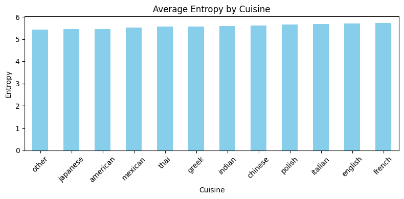
    


    
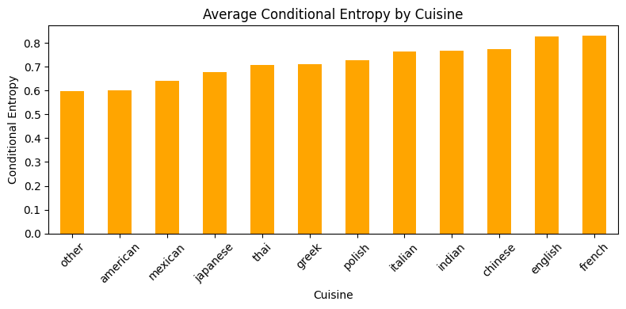
    


    
    Average 3gram_entropy by Cuisine
    cuisine
    other       6.063025
    american    6.105760
    japanese    6.188673
    mexican     6.222261
    thai        6.344106
    greek       6.345649
    indian      6.430703
    polish      6.454200
    chinese     6.464486
    italian     6.519914
    english     6.618408
    french      6.655038
    Name: 3gram_entropy, dtype: float64
    


    
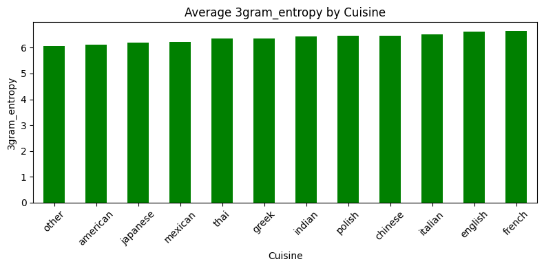
    


    
    Average 4gram_entropy by Cuisine
    cuisine
    other       6.047431
    american    6.091789
    japanese    6.174334
    mexican     6.211541
    greek       6.338894
    thai        6.340512
    indian      6.429789
    polish      6.448332
    chinese     6.466921
    italian     6.520556
    english     6.617552
    french      6.657460
    Name: 4gram_entropy, dtype: float64
    


    

    


    
    Average 5gram_entropy by Cuisine
    cuisine
    other       6.019809
    american    6.065720
    japanese    6.146377
    mexican     6.188124
    greek       6.317345
    thai        6.322671
    indian      6.412079
    polish      6.429406
    chinese     6.451689
    italian     6.505911
    english     6.602317
    french      6.643820
    Name: 5gram_entropy, dtype: float64
    


    
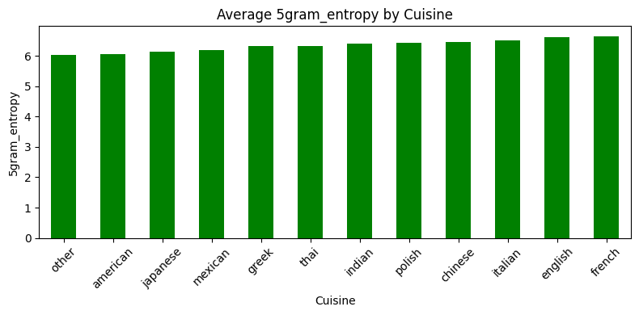
    


    
    Average Entropy by Length_Category
    length_category
    short     4.711666
    medium    5.550371
    long      6.102016
    Name: entropy, dtype: float64
    
    Average Conditional Entropy by Length_Category
    length_category
    short     0.280603
    medium    0.606489
    long      0.956663
    Name: conditional_entropy, dtype: float64
    


    
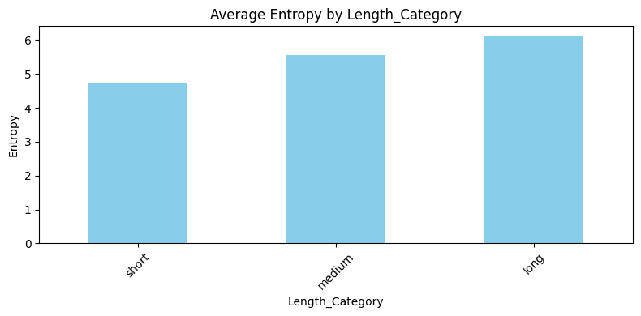
    


    
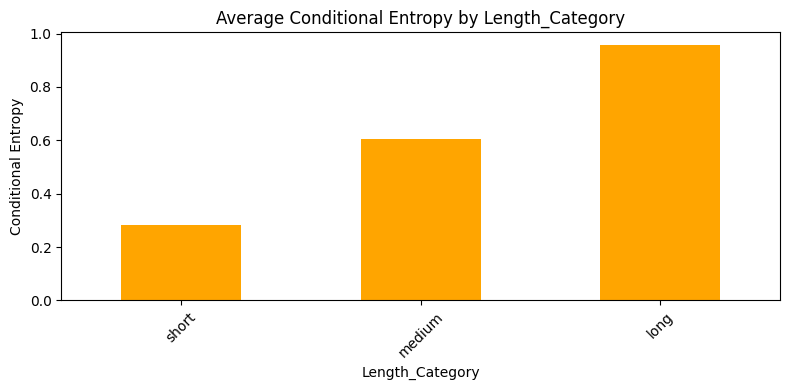
    


    
    Average 3gram_entropy by Length_Category
    length_category
    short     4.961246
    medium    6.202137
    long      7.179600
    Name: 3gram_entropy, dtype: float64
    


    
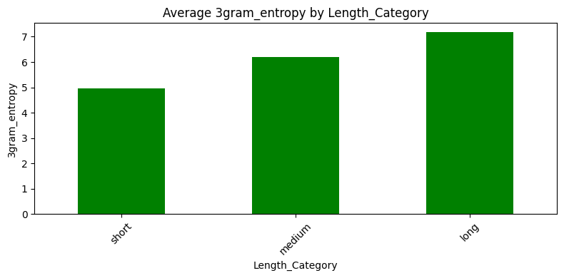
    


    
    Average 4gram_entropy by Length_Category
    length_category
    short     4.908155
    medium    6.196344
    long      7.196952
    Name: 4gram_entropy, dtype: float64
    


    

    


    
    Average 5gram_entropy by Length_Category
    length_category
    short     4.847515
    medium    6.180177
    long      7.195035
    Name: 5gram_entropy, dtype: float64
    


    
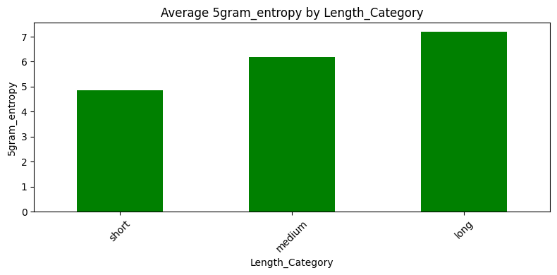
    


    
    Average Entropy by Time_Category
    time_category
    short     5.065607
    medium    5.606004
    long      5.695155
    Name: entropy, dtype: float64
    
    Average Conditional Entropy by Time_Category
    time_category
    short     0.456043
    medium    0.666196
    long      0.722285
    Name: conditional_entropy, dtype: float64
    


    
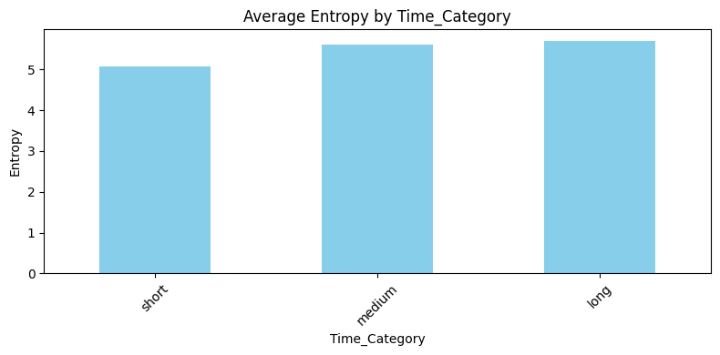
    


    
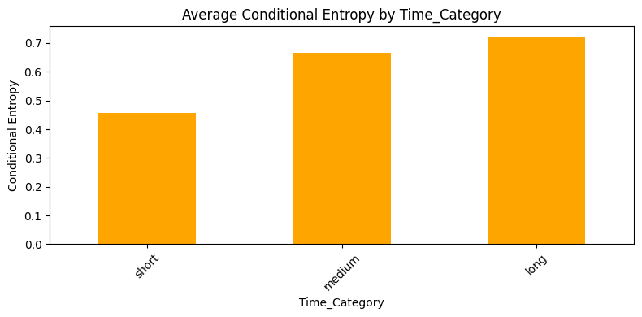
    


    
    Average 3gram_entropy by Time_Category
    time_category
    short     5.527426
    medium    6.329994
    long      6.489381
    Name: 3gram_entropy, dtype: float64
    


    

    


    
    Average 4gram_entropy by Time_Category
    time_category
    short     5.491969
    medium    6.325270
    long      6.488191
    Name: 4gram_entropy, dtype: float64
    


    
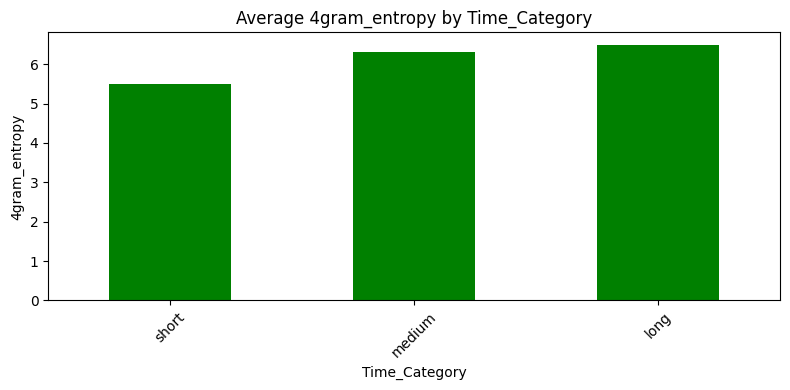
    


    
    Average 5gram_entropy by Time_Category
    time_category
    short     5.446015
    medium    6.308163
    long      6.472666
    Name: 5gram_entropy, dtype: float64
    


    
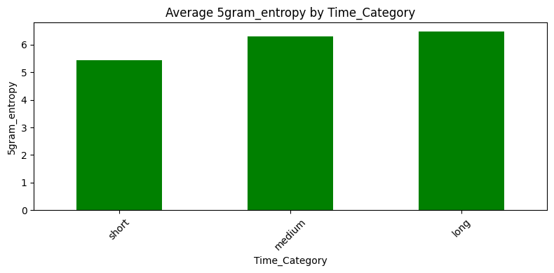
    


    
    Average Entropy by Ingredient_Category
    ingredient_category
    very few     5.061944
    few          5.375043
    moderate     5.535989
    many         5.669748
    very many    5.878632
    Name: entropy, dtype: float64
    
    Average Conditional Entropy by Ingredient_Category
    ingredient_category
    very few     0.446062
    few          0.562041
    moderate     0.636718
    many         0.706440
    very many    0.834153
    Name: conditional_entropy, dtype: float64
    


    
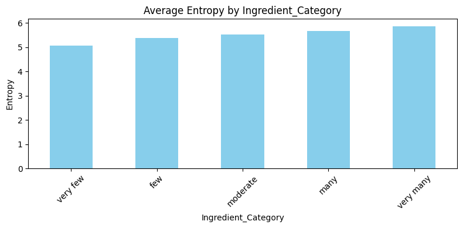
    


    

    


    
    Average 3gram_entropy by Ingredient_Category
    ingredient_category
    very few     5.514010
    few          5.971096
    moderate     6.223230
    many         6.441870
    very many    6.807546
    Name: 3gram_entropy, dtype: float64
    


    
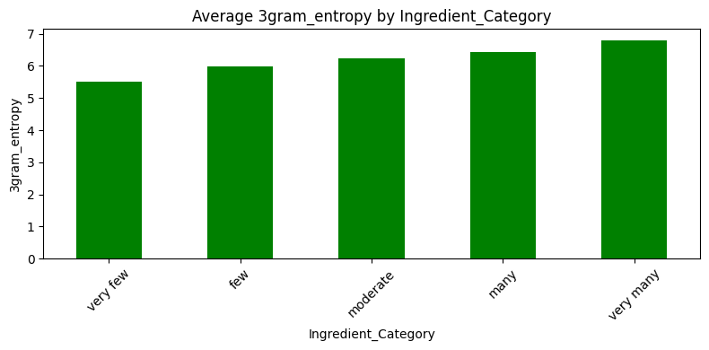
    


    
    Average 4gram_entropy by Ingredient_Category
    ingredient_category
    very few     5.477908
    few          5.953855
    moderate     6.214315
    many         6.439840
    very many    6.816391
    Name: 4gram_entropy, dtype: float64
    


    
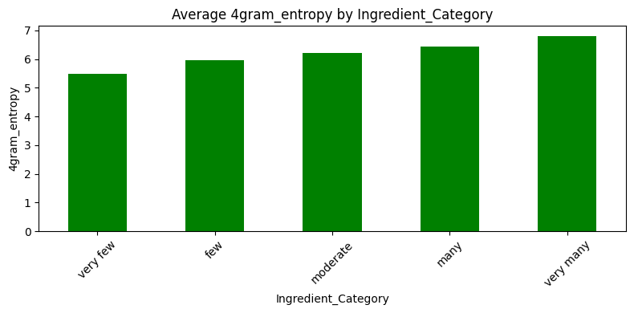
    


    
    Average 5gram_entropy by Ingredient_Category
    ingredient_category
    very few     5.431398
    few          5.925890
    moderate     6.193459
    many         6.424403
    very many    6.808032
    Name: 5gram_entropy, dtype: float64
    


    
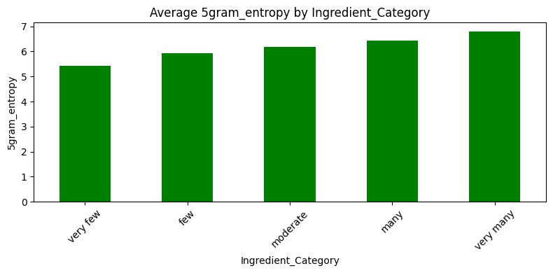
    


    
    Average Entropy by Diet_Tags
    diet_tags
    vegetarian    5.408750
    other         5.409168
    meat          5.585606
    Name: entropy, dtype: float64
    
    Average Conditional Entropy by Diet_Tags
    diet_tags
    other         0.582526
    vegetarian    0.610124
    meat          0.690863
    Name: conditional_entropy, dtype: float64
    


    
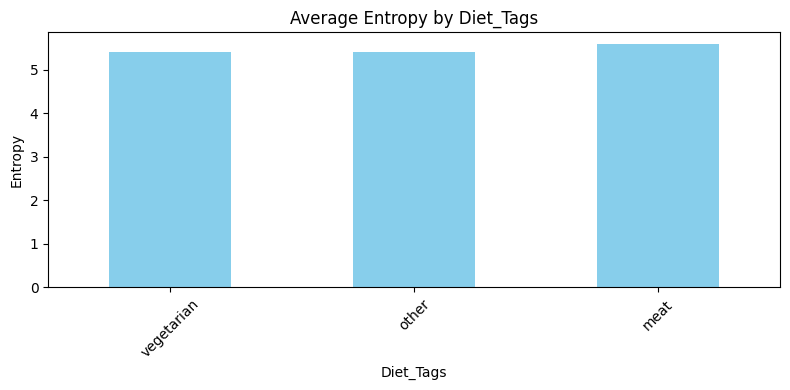
    


    
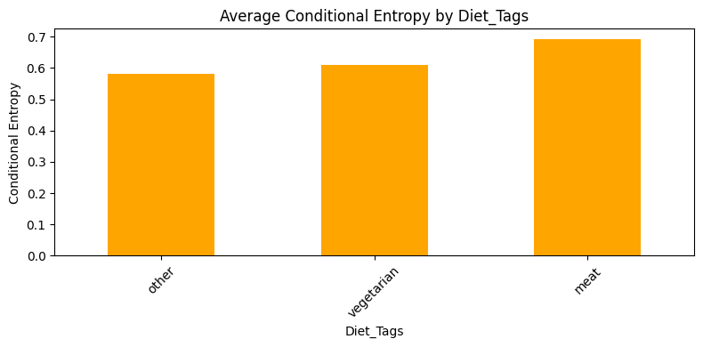
    


    
    Average 3gram_entropy by Diet_Tags
    diet_tags
    other         6.028680
    vegetarian    6.060484
    meat          6.342423
    Name: 3gram_entropy, dtype: float64
    


    
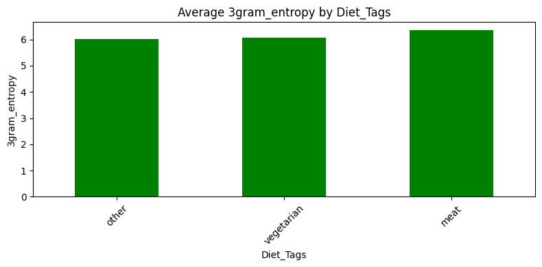
    


    
    Average 4gram_entropy by Diet_Tags
    diet_tags
    other         6.010980
    vegetarian    6.044144
    meat          6.339238
    Name: 4gram_entropy, dtype: float64
    


    

    


    
    Average 5gram_entropy by Diet_Tags
    diet_tags
    other         5.981589
    vegetarian    6.015479
    meat          6.321990
    Name: 5gram_entropy, dtype: float64
    


    

    


```python
for i in range(len(groups)):
    for j in range(i+1, len(groups)):
        run_analyses_pair(recipes_filtered, groups[i], groups[j])
```

    Mutual Information between cuisine and length_category: 0.0093
    Mutual Information between cuisine and time_category: 0.0032
    Mutual Information between cuisine and ingredient_category: 0.0118
    Mutual Information between cuisine and diet_tags: 0.0205
    Mutual Information between length_category and time_category: 0.1008
    Mutual Information between length_category and ingredient_category: 0.1352
    Mutual Information between length_category and diet_tags: 0.0096
    Mutual Information between time_category and ingredient_category: 0.0928
    Mutual Information between time_category and diet_tags: 0.0312
    Mutual Information between ingredient_category and diet_tags: 0.0231
    


```python
for col in ['cuisine', 'length_category', 'time_category', 'ingredient_category', 'diet_tags']:
    zipf_analysis(recipes_filtered, col)
```


    
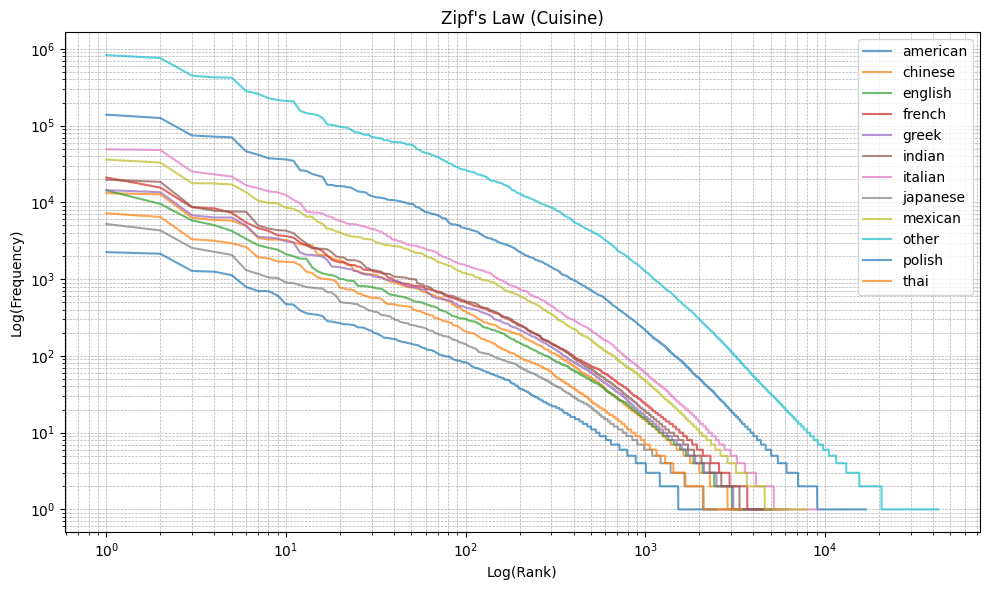
    


    
    Zipf's Law Fit Results (alpha, R^2) by Cuisine
    

    C:\Users\Kvmilos\AppData\Local\Temp\ipykernel_24668\523992455.py:2: RuntimeWarning: overflow encountered in power
      return C * rank ** (-alpha)
    C:\Users\Kvmilos\AppData\Local\Temp\ipykernel_24668\523992455.py:2: RuntimeWarning: overflow encountered in multiply
      return C * rank ** (-alpha)
    

    american             -> alpha = 0.78, R^2 = 0.95
    chinese              -> alpha = 0.79, R^2 = 0.94
    english              -> alpha = 0.87, R^2 = 0.99
    french               -> alpha = 0.84, R^2 = 0.98
    greek                -> alpha = 0.80, R^2 = 0.95
    indian               -> alpha = 0.82, R^2 = 0.95
    italian              -> alpha = 0.79, R^2 = 0.95
    japanese             -> alpha = 0.81, R^2 = 0.97
    mexican              -> alpha = 0.78, R^2 = 0.95
    other                -> alpha = 0.79, R^2 = 0.95
    polish               -> alpha = 0.77, R^2 = 0.95
    thai                 -> alpha = 0.79, R^2 = 0.96
    


    
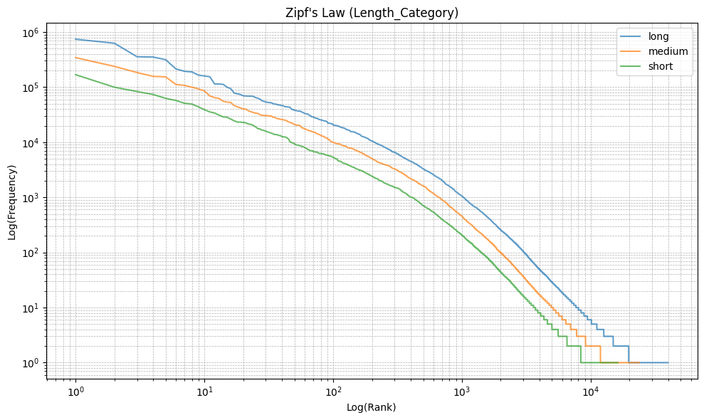
    


    
    Zipf's Law Fit Results (alpha, R^2) by Length_Category
    

    C:\Users\Kvmilos\AppData\Local\Temp\ipykernel_24668\523992455.py:2: RuntimeWarning: overflow encountered in power
      return C * rank ** (-alpha)
    C:\Users\Kvmilos\AppData\Local\Temp\ipykernel_24668\523992455.py:2: RuntimeWarning: overflow encountered in multiply
      return C * rank ** (-alpha)
    

    long                 -> alpha = 0.81, R^2 = 0.96
    medium               -> alpha = 0.79, R^2 = 0.96
    short                -> alpha = 0.78, R^2 = 0.96
    


    
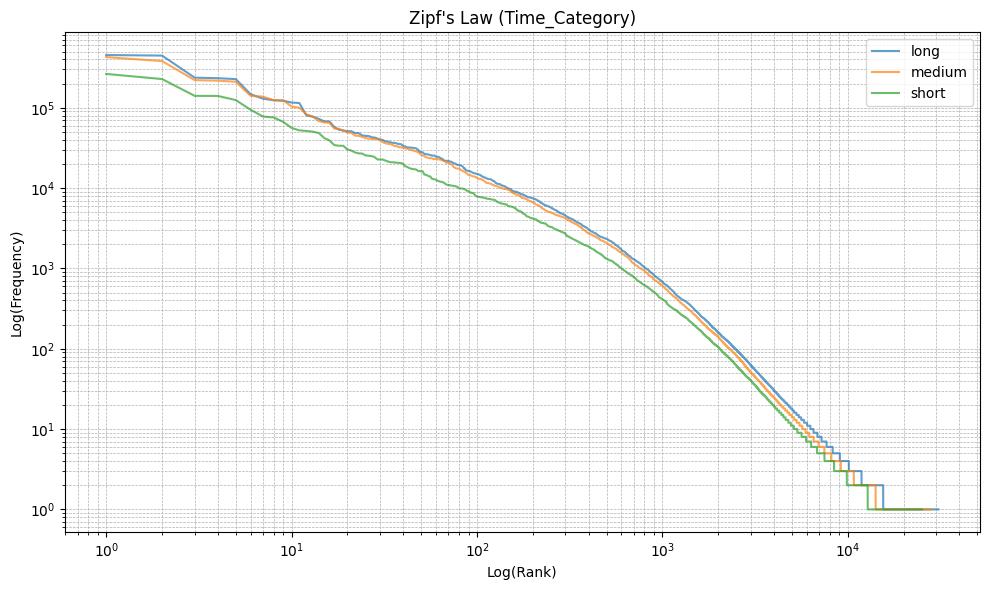
    


    
    Zipf's Law Fit Results (alpha, R^2) by Time_Category
    

    C:\Users\Kvmilos\AppData\Local\Temp\ipykernel_24668\523992455.py:2: RuntimeWarning: overflow encountered in power
      return C * rank ** (-alpha)
    C:\Users\Kvmilos\AppData\Local\Temp\ipykernel_24668\523992455.py:2: RuntimeWarning: overflow encountered in multiply
      return C * rank ** (-alpha)
    

    long                 -> alpha = 0.79, R^2 = 0.94
    medium               -> alpha = 0.79, R^2 = 0.95
    short                -> alpha = 0.79, R^2 = 0.95
    


    
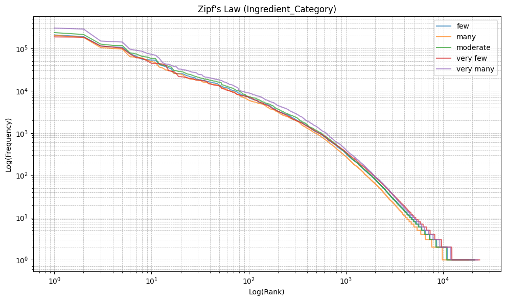
    


    
    Zipf's Law Fit Results (alpha, R^2) by Ingredient_Category
    

    C:\Users\Kvmilos\AppData\Local\Temp\ipykernel_24668\523992455.py:2: RuntimeWarning: overflow encountered in power
      return C * rank ** (-alpha)
    C:\Users\Kvmilos\AppData\Local\Temp\ipykernel_24668\523992455.py:2: RuntimeWarning: overflow encountered in multiply
      return C * rank ** (-alpha)
    

    few                  -> alpha = 0.78, R^2 = 0.95
    many                 -> alpha = 0.79, R^2 = 0.95
    moderate             -> alpha = 0.79, R^2 = 0.95
    very few             -> alpha = 0.78, R^2 = 0.94
    very many            -> alpha = 0.80, R^2 = 0.95
    


    
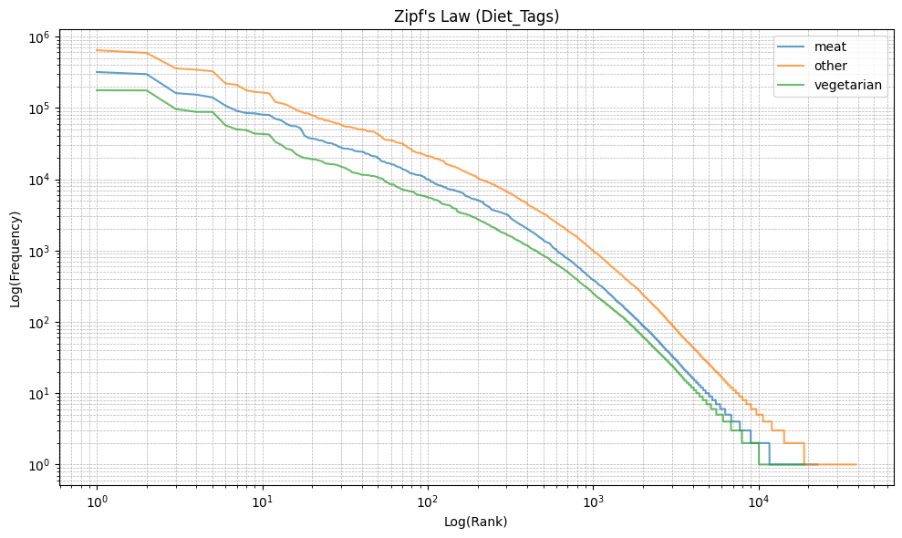
    


    
    Zipf's Law Fit Results (alpha, R^2) by Diet_Tags
    

    C:\Users\Kvmilos\AppData\Local\Temp\ipykernel_24668\523992455.py:2: RuntimeWarning: overflow encountered in power
      return C * rank ** (-alpha)
    C:\Users\Kvmilos\AppData\Local\Temp\ipykernel_24668\523992455.py:2: RuntimeWarning: overflow encountered in multiply
      return C * rank ** (-alpha)
    

    meat                 -> alpha = 0.79, R^2 = 0.95
    other                -> alpha = 0.79, R^2 = 0.95
    vegetarian           -> alpha = 0.80, R^2 = 0.94
    
