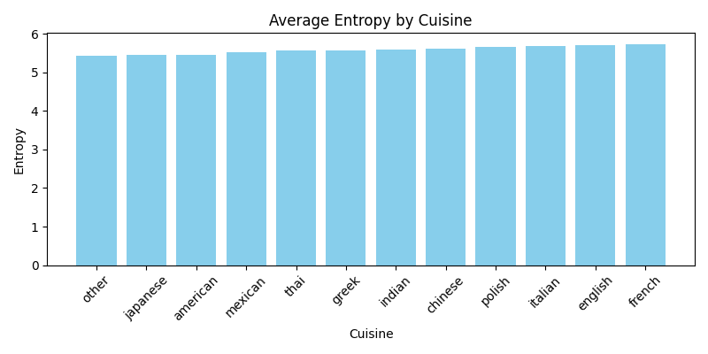
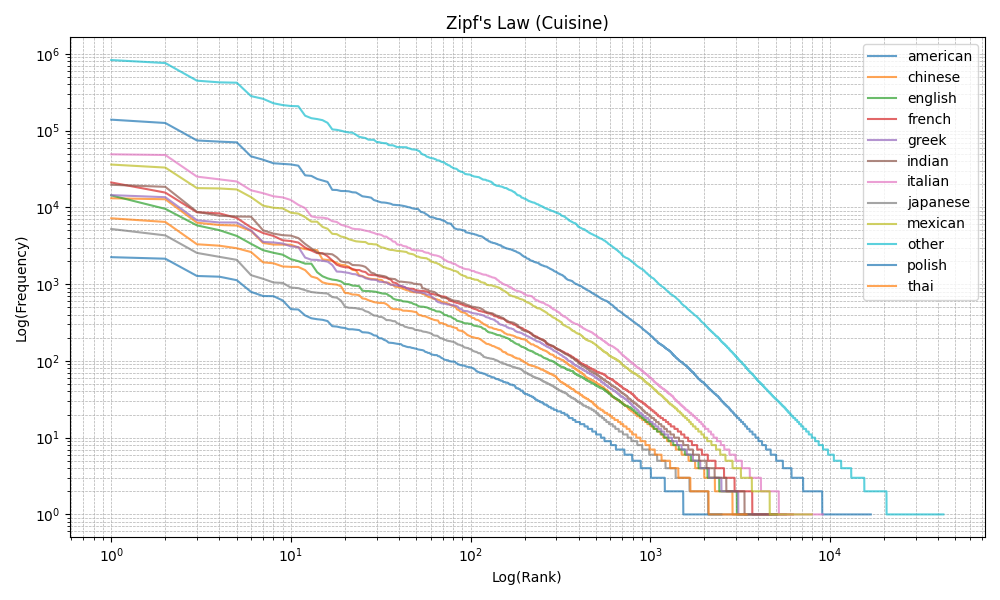
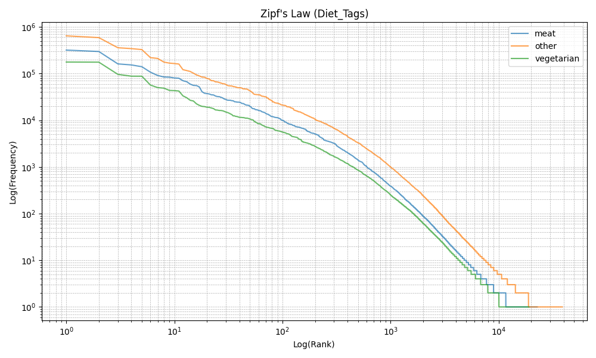

# Entropy Analysis of Recipe Instructions Across Cuisines and Complexity Levels

**Kamil Tomaszek**  

February 01, 2025  
University of Warsaw  

**Course:** Information Theory for the Cognitive Sciences  
**Instructors:** Julian Zubek & Szymon Talaga

---

## 1. Introduction

I was curious about whether recipe instructions vary in complexity across different cuisines and how aspects like the number of ingredients, the total word count of the instructions, and the number of procedural steps relate to that complexity. To explore this, I decided to apply several information-theoretic measures (such as Shannon entropy, conditional entropy, and n-gram entropy rates) to a large dataset of recipes from Food.com (available on [Kaggle](https://www.kaggle.com/datasets/shuyangli94/food-com-recipes-and-user-interactions)). I also wanted to see if the distribution of words in the recipes follows Zipf’s Law. In short, I set out to test these ideas in a data-driven way.

---

## 2. Methods

### 2.1 Dataset and Preprocessing

I used the file `RAW_recipes.csv` from the Food.com Recipes and Interactions dataset (found on Kaggle), which contains over 231,000 recipes along with metadata such as recipe name, tags, preparation time, number of ingredients, steps, and more.

**Preprocessing steps included:**

- **Filtering:** Retained only the columns `name`, `tags`, `minutes`, `n_ingredients`, `steps`, and `ingredients`.
- **Missing Values:** Dropped rows with missing values in `steps` or `ingredients`.
- **Steps Conversion:** Converted the `steps` field (stored as a string representation of a list) into an actual list of strings, keeping only recipes with non-empty step lists.
- **Tokenization:** Concatenated each recipe’s steps, converted the text to lowercase, removed punctuation and digits, and tokenized the text into words.

Below is a summary of the dataset after filtering:

- **Dataset Info:**  
  - Total entries: 231,636  
  - Memory usage: ~12.4 MB  
  - Columns: `name`, `tags`, `minutes`, `n_ingredients`, `steps`, `ingredients`

### 2.2 Grouping by Natural Categories

Rather than using arbitrary discretizations, I grouped the recipes based on natural categories:

- **Cuisine:** Extracted from recipe tags (e.g., *italian, mexican, indian,* etc.).
- **Diet Tags:** Based on tags such as *meat, vegetarian,* or *vegan*. (Note: vegan recipes didn't occur.)

### 2.3 Information-Theoretic Measures

#### 2.3.1 Shannon Entropy

For each recipe, I computed the Shannon entropy (using unigrams) to measure vocabulary diversity:

$$
H[P] = - \sum_{i} p_i \log_2 p_i
$$

#### 2.3.2 Conditional Entropy (Bigrams)

I computed the conditional entropy based on bigrams to capture sequential dependencies in the instructions:

$$
H(Y|X) = -\sum_{x,y} p(x,y) \log_2 \left(\frac{p(x,y)}{p(x)}\right)
$$

#### 2.3.3 N-gram Entropy Rates

I computed n-gram entropy rates for $n = 3, 4,$ and $5$ by dividing the raw n-gram entropy by $n$, which standardizes the values across different n-gram sizes. For example, for trigrams:

$$
\text{Trigram Entropy Rate} = \frac{H(\text{trigrams})}{3}
$$

#### 2.3.4 Mutual Information Analysis

I computed the mutual information between the natural groupings (cuisine vs. diet tags) to assess their statistical independence:

$$
I(X;Y) = \sum_{x,y} p(x,y) \log_2 \frac{p(x,y)}{p(x)p(y)}
$$

Low mutual information values would indicate that these categories are largely independent.

#### 2.3.5 Regression Analyses

To explore how instruction complexity (measured by Shannon entropy) relates to other features, I performed regression analyses using three predictors:

- **Number of Ingredients ($n\_ingredients$)**
- **Total Number of Words in Instructions ($recipe\_length$)**
- **Number of Steps ($n\_steps\_count$)**

For each predictor, I performed both:

- **Linear Regression** on the raw predictor values.
- **Logarithmic Regression** on the natural logarithm of the predictor values.

I then plotted the results in a grid (3 rows × 2 columns), where the left column shows the linear fits (in blue) and the right column shows the logarithmic fits (in green).

#### 2.3.6 Zipf’s Law Analysis

I investigated Zipf’s Law by plotting the log–log relationship between word rank and frequency. The fitted power-law exponent ($\alpha$) and $R^2$ were computed for each natural group. For example, for the *Cuisine* grouping, the fitted values were computed separately for each cuisine.

### 2.4 [References for Information Theory]

The measures used in this study — most notably, Shannon entropy — are based on foundational works in information theory. The concept of entropy used here is named after Claude Shannon, who introduced it in his seminal paper, *A Mathematical Theory of Communication* (Shannon, 1948). Weaver (1953) further elaborated on the implications of this theory, providing important context and interpretation for its applications in communication and beyond.

---

## 3. Results

### 3.0 Grouping Summary

Below are tables summarizing the counts for the natural groupings.

**Cuisine Counts:**

| Cuisine   | Count  |
|-----------|--------|
| American  | 29,010 |
| Chinese   | 1,995  |
| English   | 1,416  |
| French    | 2,201  |
| Greek     | 2,213  |
| Indian    | 2,706  |
| Italian   | 7,410  |
| Japanese  | 795    |
| Mexican   | 6,677  |
| Polish    | 349    |
| Thai      | 1,156  |
| Other     | 175,708|

**Diet Tag Counts:**

| Diet Tag   | Count  |
|------------|--------|
| Meat       | 56,042 |
| Vegetarian | 35,634 |
| Other      | 139,960|

### 3.1 Basic Entropy Measures

The following table summarizes the basic entropy statistics for the entire dataset:

| Statistic | Entropy           | Conditional Entropy |
|-----------|-------------------|---------------------|
| **Count** | 231,636           | 231,636             |
| **Mean**  | 5.451791          | 0.612983            |
| **Std**   | 0.704029          | 0.346685            |
| **Min**   | 0.000000          | -1.000000           |
| **25%**   | 5.092987          | 0.379619            |
| **50%**   | 5.539623          | 0.603108            |
| **75%**   | 5.918865          | 0.839824            |
| **Max**   | 7.999994          | 2.567500            |

**Figure 2: Shannon Entropy by Cuisine**  

**Figure 3: Shannon Entropy by Diet Category**  

**Figure 4: Conditional Entropy by Cuisine**  

**Figure 5: Conditional Entropy by Diet Category**  

### 3.2 N-gram Entropy Rates

The following figures show the average n-gram entropy rates (for 3-gram, 4-gram, and 5-gram) by the chosen grouping.

**Figure 6: Average N-gram Entropy Rates by Cuisine**  

**Figure 7: Average N-gram Entropy Rates by Diet Category**  

### 3.3 Regression Analyses

The following grid summarizes the regression outputs for each predictor (Number of Ingredients, Recipe Length, and Number of Steps) comparing Linear and Logarithmic Regressions.

**Figure 8: Regression Analysis Grid**  

The printed regression outputs are as follows:

| Predictor       | Regression Type   | Coefficient | Intercept | R²     |
|-----------------|-------------------|-------------|-----------|--------|
| n\_ingredients  | Linear            | 0.0780      | 4.7457    | 0.1712 |
| n\_ingredients  | Logarithmic       | 0.6750      | 4.0254    | 0.1777 |
| recipe\_length  | Linear            | 0.0074      | 4.6930    | 0.6096 |
| recipe\_length  | Logarithmic       | 0.9420      | 1.3135    | 0.9207 |
| n\_steps\_count | Linear            | 0.0887      | 4.5854    | 0.5707 |
| n\_steps\_count | Logarithmic       | 0.9897      | 3.3719    | 0.7625 |

### 3.4 Mutual Information

Below is a summary of the mutual information computed between the natural groupings:

| Comparison         | Mutual Information (bits) |
|--------------------|---------------------------|
| Cuisine vs. Diet   | ~0.0205                   |

### 3.5 Zipf’s Law

The following tables summarize the Zipf’s law fit parameters.

**By Cuisine:**

| Cuisine   | Alpha | R²    |
|-----------|-------|-------|
| American  | 0.78  | 0.95  |
| Chinese   | 0.79  | 0.94  |
| English   | 0.87  | 0.99  |
| French    | 0.84  | 0.98  |
| Greek     | 0.80  | 0.95  |
| Indian    | 0.82  | 0.95  |
| Italian   | 0.79  | 0.95  |
| Japanese  | 0.81  | 0.97  |
| Mexican   | 0.78  | 0.95  |
| Other     | 0.79  | 0.95  |
| Polish    | 0.77  | 0.95  |
| Thai      | 0.79  | 0.96  |

**By Diet Tag:**

| Diet Tag   | Alpha | R²    |
|------------|-------|-------|
| Meat       | 0.79  | 0.95  |
| Other      | 0.79  | 0.95  |
| Vegetarian | 0.80  | 0.94  |

Additionally, the following figures show the Zipf’s law plots:

**Figure 9: Zipf's Law for Cuisine**  

**Figure 10: Zipf's Law for Diet Tags**  

---

## 4. Discussion and Conclusion

In this study, I explored how recipe instruction complexity varies with cuisine and structural features of the recipes. My findings are as follows:

1. **Complexity Differences by Cuisine and Diet:**  
   - Recipes from certain cuisines (e.g., French or English) tend to have slightly higher entropy compared to those from other groups such as American or “other.”
   - There are also detectable differences in vocabulary complexity between diet tags (e.g., meat vs. vegetarian), although these differences are modest.

2. **Relationship with Recipe Structure:**  
   - There is a strong positive correlation between instruction complexity and the length of the instructions (both total word count and number of steps). Longer instructions tend to use a more diverse vocabulary.
   - The log-transformed regressions suggest that the relationship is nonlinear, with recipe length and number of steps being even more predictive of entropy when modeled on a logarithmic scale.

3. **Zipf’s Law:**  
   - The adherence of word frequencies to Zipf’s Law reinforces the idea that recipe instructions, although domain-specific, share fundamental properties with natural language.

Overall, these results demonstrate that information-theoretic measures can offer meaningful insights into the structure and complexity of recipe instructions. This analysis may have implications for how recipes are written and understood and provides a foundation for further work in culinary linguistics.

---

## 5. References

- Shannon, C. E. (1948). A Mathematical Theory of Communication. *Bell System Technical Journal*, 27(3), 379–423.
- Weaver, W. (1953). Recent Contributions to the Mathematical Theory of Communication. In *ETC: A Review of General Semantics*, 10(4), 261–281.
- [Food.com Recipes and Interactions Dataset](https://www.kaggle.com/datasets/shuyangli94/food-com-recipes-and-user-interactions)

---

## Appendix: Code Repository

A full overview of the code used in this analysis is available in my git repository: [GitHub](https://github.com/kvmilos/Information-Theory-Project)
